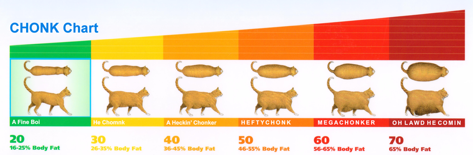
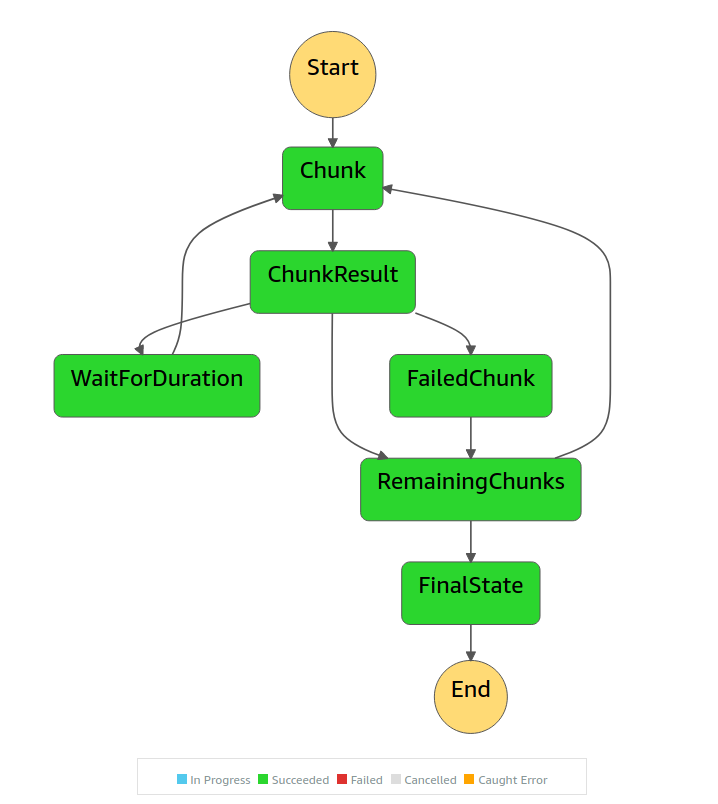

  

<h1 style="font-size: 56px; margin: 0; padding: 0;" align="center">
  chunky
</h1>

  
  
  

  

### Common Commands

Use the `make help` command to view prepared commands for use within this codebase. Make is your friend, make will help

## Contributing

Please read [CODE_OF_CONDUCT.md](CODE_OF_CONDUCT.md) for details on our code of conduct and the process for submitting pull requests.

## Changelog

Please see the [CHANGELOG.md](../CHANGELOG.md) for details on individual releases.
